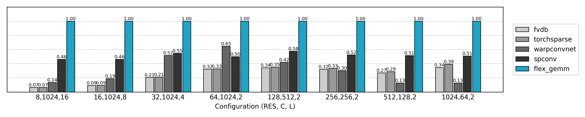
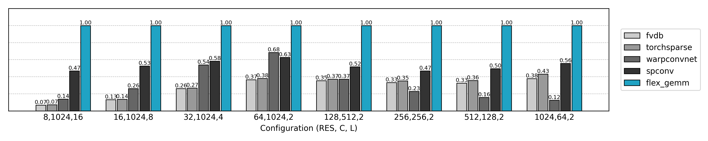

# FlexGEMM

[](https://opensource.org/licenses/MIT)
[](https://github.com/openai/triton)
[](https://pytorch.org/)

**FlexGEMM** is a high-performance, **Triton-powered GEMM backend** designed for **3D sparse convolutions**. 

It implements **Explicit**, **Implicit**, and **Masked Implicit** algorithm variants, featuring optional **Split-K** parallelism for sparse GEMM. FlexGEMM delivers **state-of-the-art performance** for Submanifold Convolution and voxel-based neural networks, consistently outperforming existing solutions.

### Resources
- **Deep Dive**: Read the technical blog at [JeffreyXiang's Blog](https://jeffreyxiang.github.io/en/blogs/flexgemm).
- **Real-world Demo**: See FlexGEMM in action in the [TRELLIS.2](https://github.com/microsoft/TRELLIS.2) project.


## ✨ Why FlexGEMM?

- **Triton-First Architecture**: Built entirely on [Triton](https://github.com/triton-lang/triton), ensuring high-performance kernel execution and cross-platform compatibility.
- **Sparse-Optimized**: Specifically tailored for 3D sparse tensors, efficiently handling highly irregular sparsity patterns.
- **Blazing Fast**: Consistently outperforms standard sparse convolution libraries (such as `spconv`, `torchsparse`) in training throughput.

## 🛠️ Installation

### Prerequisites
* **PyTorch** ≥ 2.4.0
* **Triton** ≥ 3.2.0

### Install via pip
```bash
git clone https://github.com/JeffreyXiang/FlexGEMM.git
cd FlexGEMM
pip install . --no-build-isolation
```

## 💻 Usage Example

Here is a minimal example demonstrating how to perform a sparse submanifold convolution using FlexGEMM:

```python
import torch
import flex_gemm
from flex_gemm.ops.spconv import sparse_submanifold_conv3d
from tests.spconv_fwd import sphere_coords

# 1. Prepare Sparse Voxel Data
# Generate a sparse voxel shell
feats, coords, shape = sphere_coords(256, 256, dtype=torch.float16, device='cuda')

# 2. Define Weights and Bias
Ci, Co = 256, 256
Ks = 3
weight = torch.randn(Co, Ks, Ks, Ks, Ci, dtype=torch.float16, device='cuda', requires_grad=True)
bias = torch.randn(Co, dtype=torch.float16, device='cuda', requires_grad=True)

# 3. Configure Algorithm
# Example: Using Masked Implicit GEMM with Split-K optimization
flex_gemm.ops.spconv.set_algorithm(
    flex_gemm.ops.spconv.Algorithm.MASKED_IMPLICIT_GEMM_SPLITK
)

# 4. Forward Pass
out_feats, neighbor_cache = sparse_submanifold_conv3d(
    feats, coords, shape,
    weight, bias,
)

# 5. Backward Pass
out_feats.sum().backward()
```

### Using with `torch.compile`

FlexGEMM supports `torch.compile` via custom op wrappers. The key idea
is to **separate preparation from computation**: build the neighbor
cache once (outside compile), freeze it into a `SpConvConfig`, then use
that config inside the compiled region.

```python
import torch
import flex_gemm
from flex_gemm.ops.spconv import (
    Algorithm, SpConvConfig, set_algorithm, sparse_submanifold_conv3d,
)

# --- Phase 1: Preparation (outside torch.compile, run once) ---

feats, coords, shape = ...  # your sparse voxel data
weight = torch.randn(Co, Ks, Ks, Ks, Ci, device='cuda', requires_grad=True)
bias = torch.randn(Co, device='cuda', requires_grad=True)

set_algorithm(Algorithm.MASKED_IMPLICIT_GEMM_SPLITK)

# Run one eager forward pass to build the neighbor cache and warm up autotune
with torch.no_grad():
    _, neighbor_cache = sparse_submanifold_conv3d(feats, coords, shape, weight, bias)

# Freeze: pre-computes all block-size variants, returns a compile-friendly config
config = neighbor_cache.freeze()

# --- Phase 2: Compiled training loop ---

@torch.compile
def train_step(feats, weight, bias):
    # Pass config= to use the compiled path (returns output only, no cache)
    out = sparse_submanifold_conv3d(feats, weight=weight, bias=bias, config=config)
    return out.sum()

loss = train_step(feats, weight, bias)
loss.backward()
```

> **Note**: The `config=` path is only needed for `torch.compile`.
> The legacy API (`sparse_submanifold_conv3d(feats, coords, shape, weight, bias)`)
> continues to work unchanged for eager execution.

## 📊 Performance

FlexGEMM demonstrates significant speed improvements over existing baselines.

**Test Environment:**
* **GPU**: NVIDIA A100 80GB PCIe
* **Software**: PyTorch 2.4.1, CUDA 12.0, Triton 3.2.0

### Benchmark Results

> **Note**: FlexGEMM achieves **~2× acceleration** compared to previous state-of-the-art methods under efficient data formats like FP16 and TF32.

#### 1. FP16 Precision (Training Speed)


#### 2. TF32 Precision (Training Speed)


#### 3. FP32 Precision (Training Speed)


### Performance Summary

*   **SOTA Speed**: Consistently outperforms `spconv`, `torchsparse`, and `fvdb`.
*   **Scalability**: Robust performance across various channel widths (C=64 to C=1024) and resolutions (RES=8 to RES=1024).
*   **Memory Efficient**: Delivers higher throughput without increasing GPU memory overhead.
*   **Application Ready**: Ideal for high-resolution voxelized point clouds, submanifold convolutions, and large-scale 3D networks.

## 🤝 Contributing

We welcome contributions to make FlexGEMM faster and more robust!

### How to help
*   **Report Bugs**: Open an issue describing the bug and how to reproduce it.
*   **Suggest Features**: Have an idea for a new algorithm or optimization? Let us know!
*   **Submit Pull Requests**:
    1.  Fork the repository and create your branch from `main`.
    2.  Ensure your code follows the project's style.
    3.  Run the tests in the `tests/` directory to ensure no regressions.
    4.  Open a Pull Request with a detailed description.

We appreciate all contributors who help improve this project!

## 📜 License

This project is released under the [MIT License](LICENSE).